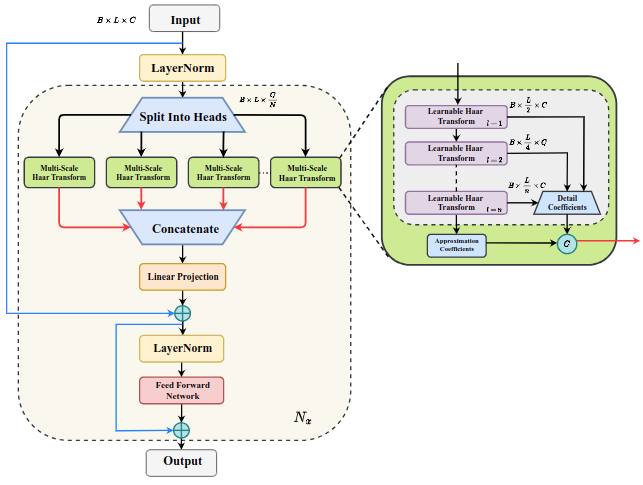
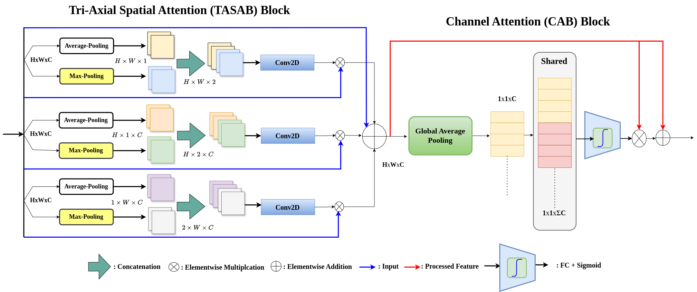
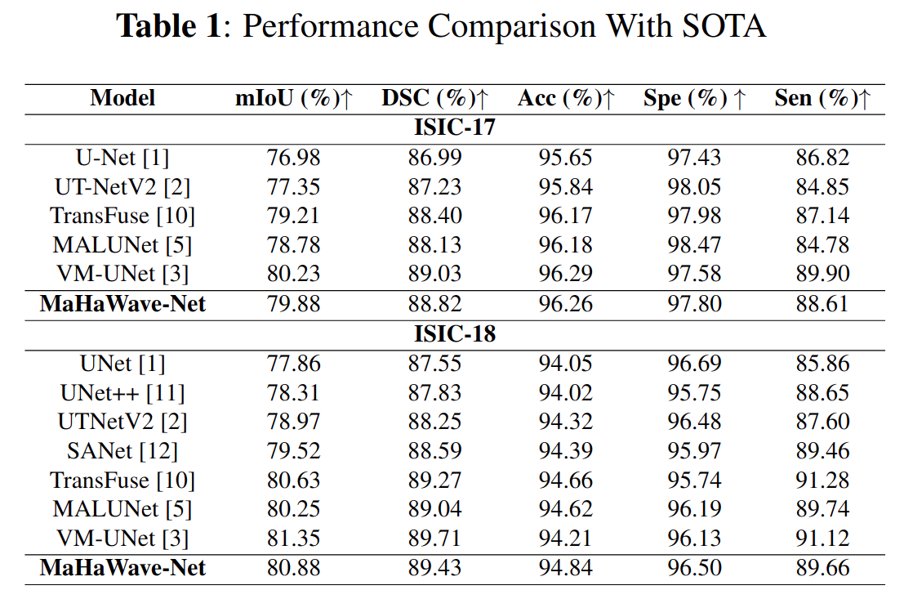
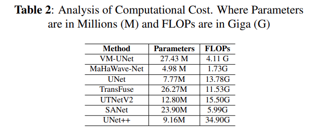
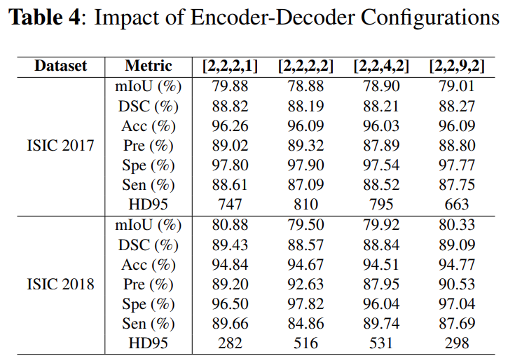

# MaHaWave-Net-A-Lightweight-Multi-Scale-Model-for-Fine-Grained-Medical-Image-Segmentation
Code will be resealing soon..!!

## Abstract
In recent years, U-Net–based transformer models have achieved remarkable success in medical image segmentation by effectively capturing hierarchical features. Visual state space models have recently emerged as an efficient alternative, offering competitive accuracy with linear complexity. However, both transformer-based and Mamba-based U-Nets suffer from high computational complexity in terms of model parameters and floating-point operations. Inspired by the strengths of both approaches, we propose MaHaWave-Net, a novel and lightweight U-Net-like architecture combining Mamba state space blocks, newly designed learnable Haar Wavelet layers, and MLP layers. The proposed learnable wavelet layers efficiently capture fine-grained information by extracting approximation and detail coefficients across multiple levels, mitigating information loss and serving as a linear-complexity alternative module to the transformer self-attention module. Extensive experiments on ISIC 2017 and ISIC 2018 datasets illustrate that MaHaWave-Net consistently outperforms existing methods. Compared to U-Net, it achieves Dice/IoU improvements of 2.09\% and 3.33\% on ISIC 2017 and 1.78\% and 2.88\% on ISIC 2018, with significantly reduced computational cost, establishing its effectiveness as a lightweight medical image segmentation model.

## 0. Main Environments
```bash
conda create -n vmunet python=3.8
conda activate vmunet
pip install torch==1.13.0 torchvision==0.14.0 torchaudio==0.13.0 --extra-index-url https://download.pytorch.org/whl/cu117
pip install packaging
pip install timm==0.4.12
pip install pytest chardet yacs termcolor
pip install submitit tensorboardX
pip install triton==2.0.0
pip install causal_conv1d==1.0.0  # causal_conv1d-1.0.0+cu118torch1.13cxx11abiFALSE-cp38-cp38-linux_x86_64.whl
pip install mamba_ssm==1.0.1  # mmamba_ssm-1.0.1+cu118torch1.13cxx11abiFALSE-cp38-cp38-linux_x86_64.whl
pip install scikit-learn matplotlib thop h5py SimpleITK scikit-image medpy yacs
```
The .whl files of causal_conv1d and mamba_ssm could be found here. {[Baidu](https://pan.baidu.com/s/1Tibn8Xh4FMwj0ths8Ufazw?pwd=uu5k) or [GoogleDrive](https://drive.google.com/drive/folders/1ZJjc7sdyd-6KfI7c8R6rDN8bcTz3QkCx?usp=sharing)}

## 1. Prepare the dataset

### ISIC datasets
- The ISIC17 and ISIC18 datasets, divided into a 7:3 ratio.

- After downloading the datasets, you are supposed to put them into './data/isic17/' and './data/isic18/', and the file format reference is as follows. (take the ISIC17 dataset as an example.)

- './data/isic17/'
  - train
    - images
      - .png
    - masks
      - .png
  - val
    - images
      - .png
    - masks
      - .png

## 2. Proposed Framework


*Figure 1 (a): Overview of the proposed MaHaWave-Net architecture.*



*Figure 1 (b): illustrates the architecture of the MLHW block.*



*Figure 2 : illustrates TASAB and CAB Module block.*

## 3. Result 
<p align="center">
  
</p>
The results, summarized in Table.1, show that MahaWave-Net achieves competitive performance on ISIC 2017 across four key metrics, Viz. mIoU, Accuracy (Acc), Precision (Pr), and Specificity (Spe), while surpassing existing methods on ISIC 2018 in terms of Accuracy and Specificity. In particular, the model attains 94.84\% accuracy and 96.50\% specificity on ISIC 2018, slightly outperforming the more complex VM-UNet (94.21\% accuracy, 96.13\% specificity) with improvements of 0.63\% in accuracy and 0.37\% in specificity. The performance improvements can be attributed to the use of multi-scale learnable wavelet layers, which enhance fine-grained feature extraction and preserve contextual information across multiple scales. Notably, MahaWave-Net delivers these results with substantially fewer parameters and reduced FLOPs compared to transformer- and mamba-based models. This synergy of accuracy and efficiency makes MahaWave-Net highly effective for medical image segmentation and particularly well-suited for deployment on resource-limited edge devices, where many SOTA models face challenges due to their complexity.

## 4. Ablation Study
### 1. Computational Complexity 
Table.2 below of Computational_Cost presents a comparison of the trainable parameters and floating-point operations (FLOPs) required by the proposed model and several state-of-the-art methods for medical image segmentation.
<p align="center">
  
</p>

Among the compared models, VM-UNet exhibits the highest parameter count and subsequently, UNet++ exhibits the highest FLOPs count. In contrast, the proposed model requires the least computational resources, with only 4.98 million trainable parameters and 1.73 Giga FLOPs. It specifically reduces the number of parameters and FLOPs by factors of 5.55 and 2.37, respectively, compared to the best-performing VM-UNet model. 

### 2. Impact  of Levels 
We evaluated six different values of this parameter, Viz.~12, 18, 24, 30, 36, and 42. The results clearly indicate that increasing the number of levels enhances the performance of MaHaWave-Net, as it enables the model to capture richer multi-scale features for fine-grained image segmentation. The best results are achieved when the level parameter is set to 42 for both datasets.
<p align="center">
  
</p>

### 2. Impact  of Encoder-Decoder Depth 
To examine variations in performance metrics, we employ a strong encoder–decoder configuration in the asymmetric MaHaWave-Net design. Following \cite{ruan2024vm}, an ablation study is conducted, with results summarized in Table.4.~The model achieves optimal performance with the encoder–decoder configuration $[2,2,2,1]$ across both datasets.~However, when scaled to a larger asymmetric configuration of $[2,2,9,2]-[2,9,2,2]$, performance consistently declines, indicating that excessive scaling reduces model effectiveness. For the ablation study, the number of heads and levels is fixed at 16 and 42, respectively, and BceDice Loss is employed as the loss function.
<p align="center">
  
</p>

### 3. Impact  Isolating MLHW with Skip and Without Skip


## 6. Train the MaHaWave-Net
```bash
cd MaHaWave-Net
python train.py  # Train and test MaHaWave-Net on the ISIC17 or ISIC18 dataset.
```

**NOTE**: If you want to use the trained checkpoint for inference testing only and save the corresponding test images, you can follow these steps:  

- **In `config_setting`**:  
   - Set the parameter `only_test_and_save_figs` to `True`.  
   - Fill in the path of the trained checkpoint in `best_ckpt_path`.  
   - Specify the save path for test images in `img_save_path`.  

- **Execute the script**:  
   After setting the above parameters, you can run `train.py`.

## 7. Obtain the outputs
- After trianing, you could obtain the results in './results/'

##  4. Acknowledgement 

We are grateful for the following awesome projects when implementing MaHaWave-Net:

- [VM-UNet](https://github.com/JCruan519/VM-UNet)
- [MambaVision](https://github.com/NVlabs/MambaVision)
- [MALUNet](https://github.com/JCruan519/MALUNet)


