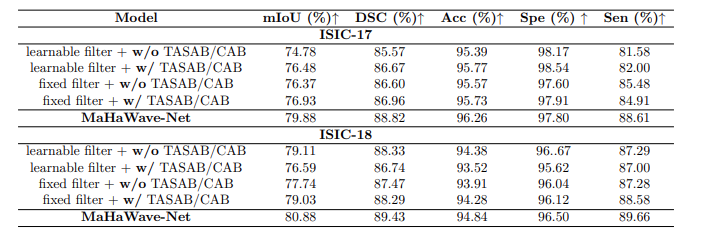

# MaHaWave-Net-A-Lightweight-Multi-Scale-Model-for-Fine-Grained-Medical-Image-Segmentation
Code will be resealing soon..!!

##  Ablation Study

### 1. Impact  Isolating MLHW with Skip and Without Skip

*Table-1: Ablation on isolating the MLHW block (with and without TASAB/CAB, and with fixed vs
learnable filters).*

### 2.  Per-image inference latency on GPU

##1. **MaHaWave-Net (Ours)**     ===> **1.19 iteration/sec** \\
##2. VMUNet                  ===> 2.07 iteration/sec \\
##3. UNet                    ===> 2.11 iteration/sec \\
##4. UNet++                  ===> 2.09 iteration/sec

