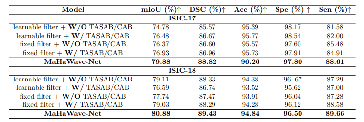
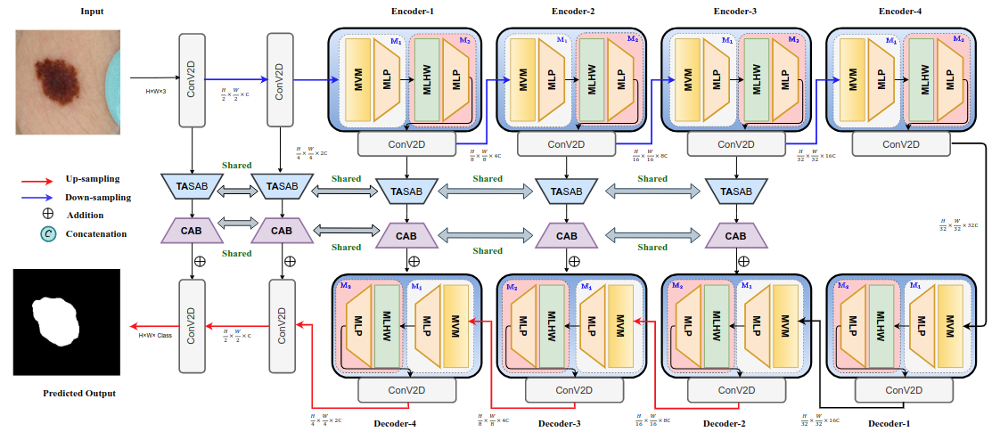

# MaHaWave-Net-A-Lightweight-Multi-Scale-Model-for-Fine-Grained-Medical-Image-Segmentation
Code will be released soon !!

##  1 Ablation Study

### 1. Ablation study on Incorporating learnable Haar coefficient-based filter layers vs Static Haar Coefficient-based layers within the MLHW block (W =With, W/O = Without)

*Table-1: Ablation on isolating the MLHW block (with and without TASAB/CAB, and with Static vs
learnable filters).*

### 2.  Analysis of the inference time for a test image on ( NVIDIA GPU-H100)

| Model                 | Iterations / Sec |
|-----------------------|------------------|
| **MaHaWave-Net (Ours)** | **1.19** |
| VMUNet               | 2.07 |
| UNet                 | 2.11 |
| UNet++               | 2.09 |

## 2 Proposed Framework

*Figure 1 (a): Overview of the proposed MaHaWave-Net architecture.*

